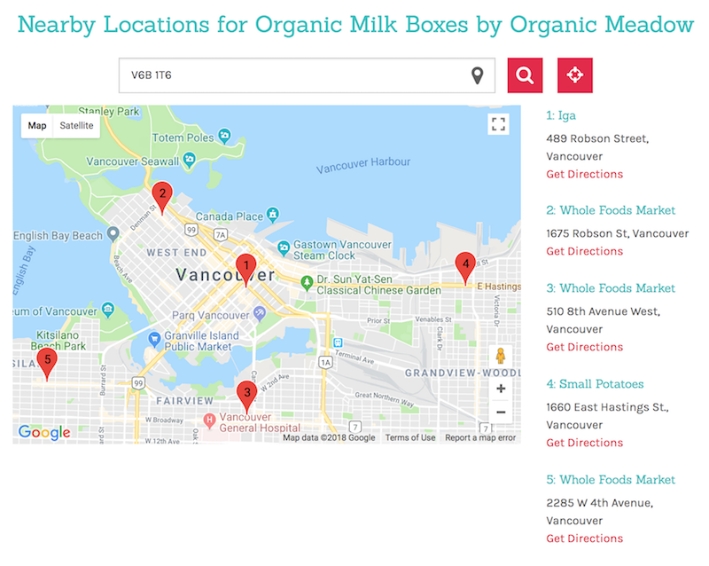

title: Brendon O'Laney - Store Locator
author: Brendon O'Laney
css: ../css/style.css

<h1>Store Locator</h1>
<h2>A system to find and sort locations distance in Javascript, C#, and
PostgreSQL/PostGIS</h2>

The store locator is unique in that it does not rely entirely on one service for it's
operation. Whenever an address is added into the database, the [Automation Engine] [1]
caches address data with geolocation coordinates (currently Google, but theoretically
any service could substitute). When the store locator is queried, PostGIS does a great
circle calculation to the nearest locations and returns with a top list including
metadata. On the front end it overlays our data on top of a google map. However, since
the data is ours, it would be trivial to switch to another service for visualization
such as Apple Maps, or OpenStreetMap should usage terms change in the future.

[Home](../index.html)

[1]: ./ae.html

